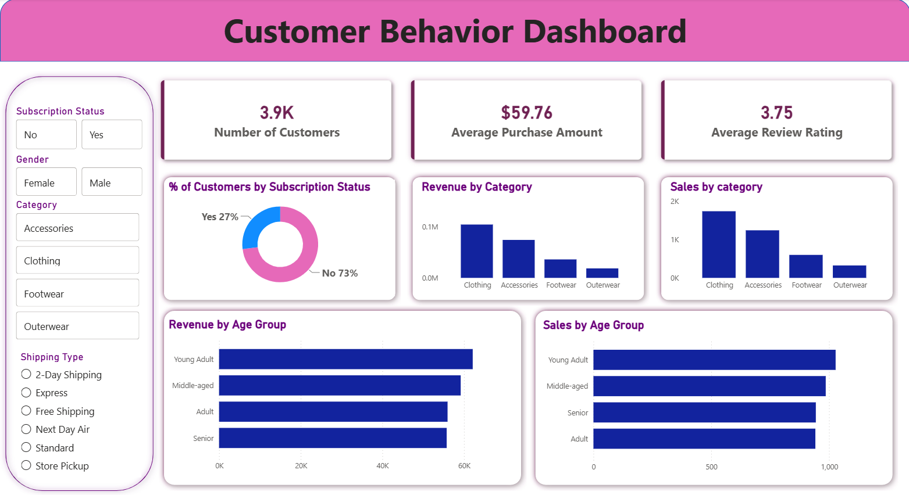

# Customer Shopping Behavior Analysis

An end-to-end **Data Analytics** project that analyzes customer shopping behavior using **Python, PostgreSQL, SQL, and Power BI**. The project transforms raw transactional data into actionable business insights through data cleaning, SQL analysis, customer segmentation, and interactive dashboard visualization.

---

## Dashboard Preview

> **Note:** Upload a screenshot of your Power BI dashboard to the repository and replace the image path below.



---

## Project Overview

Retail businesses generate large amounts of customer transaction data every day. This project analyzes over **3,900 customer purchase records** to understand shopping patterns, customer demographics, spending behavior, subscription trends, and product performance.

The objective is to help businesses make data-driven decisions by identifying meaningful trends and providing actionable recommendations.

---

## Business Problem

A retail company wants to better understand customer shopping behavior in order to:

- Improve customer engagement
- Increase sales
- Identify high-value customer segments
- Optimize marketing campaigns
- Improve customer retention
- Understand purchasing trends

---

## Dataset Summary

- **Total Records:** 3,900
- **Features:** 18
- Customer Demographics
- Purchase Details
- Product Categories
- Subscription Status
- Shipping Information
- Discounts & Promotions
- Customer Ratings

---

## Tech Stack

- **Python**
  - Pandas
  - NumPy

- **Database**
  - PostgreSQL

- **SQL**

- **Power BI**

- **Git & GitHub**

---

## Project Workflow

```
Raw Dataset
      │
      ▼
Python
(Data Cleaning & Feature Engineering)
      │
      ▼
PostgreSQL
(Database Integration)
      │
      ▼
SQL
(Business Analysis)
      │
      ▼
Power BI
(Interactive Dashboard)
      │
      ▼
Business Insights & Recommendations
```

---

## Data Preparation (Python)

The dataset was cleaned and transformed using Python.

Tasks performed:

- Imported dataset using Pandas
- Explored data structure and summary statistics
- Handled missing values
- Standardized column names
- Feature Engineering
  - Age Groups
  - Purchase Frequency
- Removed redundant columns
- Exported cleaned dataset to PostgreSQL

---

## SQL Analysis

Business-oriented SQL queries were written to answer important questions such as:

- Revenue by Gender
- High-Spending Discount Users
- Top Rated Products
- Shipping Type Comparison
- Subscriber vs Non-Subscriber Analysis
- Customer Segmentation
- Discount Dependency Analysis
- Revenue by Age Group
- Repeat Buyer Analysis
- Top Products by Category

---

## Power BI Dashboard

The interactive dashboard includes:

### KPI Cards

- Total Customers
- Average Purchase Amount
- Average Customer Rating

### Visualizations

- Revenue by Category
- Sales by Category
- Revenue by Age Group
- Sales by Age Group
- Subscription Distribution

### Interactive Filters

- Gender
- Product Category
- Subscription Status
- Shipping Type

---

## Business Questions Answered

- Which customer segment generates the highest revenue?
- Which products receive the highest ratings?
- Do subscribers spend more than non-subscribers?
- Which age group contributes the highest revenue?
- Which products rely heavily on discounts?
- Which shipping method generates higher purchase values?

---

## Key Insights

- Clothing generated the highest overall revenue.
- Young Adults contributed the highest revenue among all age groups.
- Loyal customers formed the largest customer segment.
- Express shipping customers spent slightly more on average.
- Some products showed heavy dependence on discounts.
- Subscription programs have opportunities for improving customer retention.

---

## Business Recommendations

- Strengthen customer loyalty programs.
- Promote exclusive subscription benefits.
- Optimize discount strategies.
- Increase visibility of top-rated products.
- Target high-value customer segments through personalized marketing.

---

## Skills Demonstrated

- Python
- Pandas
- NumPy
- PostgreSQL
- SQL
- Power BI
- Data Cleaning
- Exploratory Data Analysis (EDA)
- Feature Engineering
- Customer Segmentation
- Business Intelligence
- Dashboard Development
- Data Visualization
- Business Analytics

---

## Repository Structure

```
customer-shopping-behavior-analysis/
│
├── Business Problem Document.pdf
├── Customer-Shopping-Behavior-Analysis.pptx
├── Customer_behavior_analysis.ipynb
├── customer_behavior_analysis.sql
├── customer_behavior_dashboard.pbix
├── customer_shopping_behavior.csv
└── README.md
```

---

## Future Improvements

- Customer Lifetime Value (CLV) Analysis
- RFM Customer Segmentation
- Sales Forecasting
- Recommendation System
- Customer Churn Prediction
- Automated ETL Pipeline

---

## Project Outcome

This project demonstrates the complete data analytics lifecycle—from raw data preprocessing and SQL-based business analysis to interactive Power BI dashboard development. It showcases practical skills in Python, SQL, PostgreSQL, and Business Intelligence for solving real-world retail analytics problems.

---

## Author

**Anurag Jha**

BITS Pilani, Hyderabad Campus

**Interested in:**

- Data Analytics
- Business Intelligence
- Financial Analytics
- Data Science

If you found this project helpful, feel free to ⭐ the repository.
